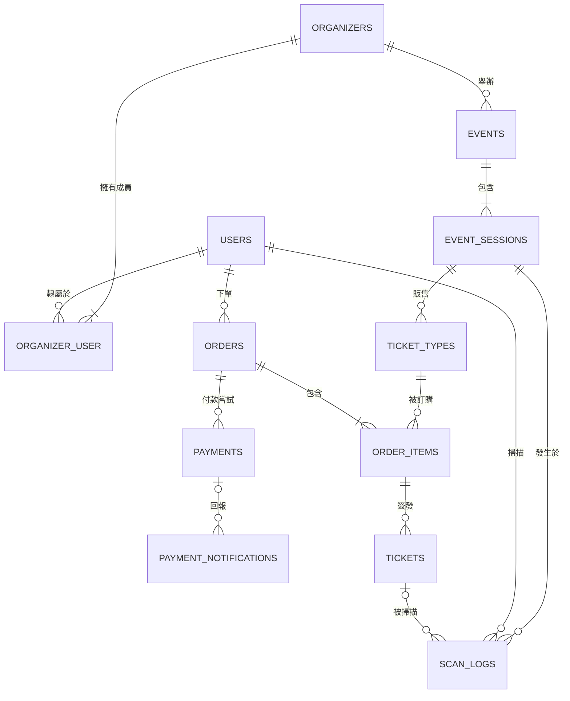

# ERD — 票務平台

W2 Step 3。**只畫實體與關聯，不畫欄位**（欄位是 Step 5）。

---

## Mermaid 基數速查

寫法：`A <左基數>--<右基數> B : "關係說明"`
左邊的符號是**反過來寫**的（開口朝線）。

| 右側寫法 | 左側寫法 | 意義 |
|---|---|---|
| `o\|` | `\|o` | 零或一 |
| `\|\|` | `\|\|` | 剛好一 |
| `o{` | `}o` | 零或多 |
| `\|{` | `}\|` | 一或多 |

常見組合：

```
A ||--o{ B    一個 A 有 0..N 個 B，一個 B 剛好屬於 1 個 A   ← 最常見
A ||--|{ B    一個 A 有 1..N 個 B（B 至少要有一個）
A }o--o{ B    多對多（通常要拆中介表）
A ||--o| B    一個 A 最多有一個 B
```

**填基數時對自己問兩個問題**（兩邊各問一次）：
1. 最少幾個？ → 0 就是 `o`，至少 1 就是 `|`
2. 最多幾個？ → 1 就是 `|`，多個就是 `{`

---

## 實體清單

### 已確定（來自 Step 2 問答的決定）

| 實體 | 說明 | 決定來源 |
|---|---|---|
| `USERS` | 平台使用者（購票者、主辦方員工共用一張表） | |
| `ORGANIZERS` | 主辦方（租戶） | Q4 |
| `ORGANIZER_USER` | 成員中介表，帶角色 | Q4：一人可屬多個主辦方 |
| `EVENTS` | 活動主體（共用名稱、說明、公告） | Q1 |
| `EVENT_SESSIONS` | 場次（有自己的時間與**容量**） | Q1 + 兩層庫存 |
| `TICKET_TYPES` | 票種（價格、配額、販售時間） | Q2：掛在場次 |
| `ORDERS` | 訂單（狀態、到期時間） | |
| `ORDER_ITEMS` | 訂單明細（票種、張數、下單當下單價） | |
| `PAYMENTS` | 付款嘗試紀錄（一筆訂單可能多次） | 第三組 Q2 |
| `PAYMENT_NOTIFICATIONS` | 金流回調原文（唯一約束擋重送） | 第三組 Q3 |
| `TICKETS` | 票券憑證，付款成功後才簽發 | 第三組 Q2 |
| `SCAN_LOGS` | 掃碼紀錄（含失敗），保留歷史 | 離線驗票討論 |

### 已排除（連同理由，Step 6 會展開成 ADR）

| 實體 | 決定 | 理由 | 留下的擴充點 |
|---|---|---|---|
| `VENUES` | 不獨立，場地資訊放 `EVENT_SESSIONS` 欄位 | 領域邊界：我們是售票方，主體是活動，不是場館經營者 | 時區欄位落在 sessions 上；代價是場地名稱自由文字、搜尋不精準 |
| `CHECK_INS` | 不建表 | 避免同一事實有兩個來源。`TICKETS.checked_in_at`（條件 UPDATE 保正確性）+ `SCAN_LOGS`（保歷史）已覆蓋 | — |
| `REFUNDS` | 不建表，但訂單狀態要有 `refund_required` | 自動退款牽涉部分退款、手續費歸屬、各家金流 API 差異，對防超賣主線無貢獻 | 未來加 `refunds` 表關聯 `PAYMENTS`，支援一筆付款多次部分退款 |

**原則**：範圍外的東西要**留出口**，不要留空白。活動取消時已付款的訂單必須有地方可去。

---|---|
| `VENUES` | 場地要不要獨立？同一場地會被重複使用嗎？不獨立就是 sessions 上幾個欄位 |
| `CHECK_INS` | 核銷要獨立一張表，還是 `TICKETS` 上的 `checked_in_at` 欄位 + `SCAN_LOGS` 就夠？ |
| `REFUNDS` | 退款這期做不做？（範圍題） |

---

## 圖



---

## 路徑走查（驗證用，已完成）

**正向 —— 從人走到入場**
```
USERS → ORDERS → ORDER_ITEMS → TICKETS → SCAN_LOGS
```

**支線 —— 購票時票種怎麼被找到**
```
EVENT_SESSIONS → TICKET_TYPES → ORDER_ITEMS
```

**反向 —— 驗票畫面要顯示的四個資訊**

| 要顯示 | 路徑 | 步數 |
|---|---|---|
| 「早鳥票」 | `TICKETS → ORDER_ITEMS → TICKET_TYPES` | 2 |
| 「12/25 場次」 | `TICKETS → ORDER_ITEMS → TICKET_TYPES → EVENT_SESSIONS` | 3 |
| 「有效」 | `TICKETS` 自己的欄位 | 0 |
| 「訂購人小明」 | `TICKETS → ORDER_ITEMS → ORDERS → USERS` | 3 |

### 走查找到的缺口：持票人

情境：小明買 2 張，一張給女朋友。驗票員掃女朋友的票，該顯示誰？

圖走得到「下單人」，走不到「持票人」——而 `events.md` 的「票券已簽發」事件裡就寫了持票人。
**走查暴露的不一定是漏線，也可能是漏掉一個概念。**

三種設計：

| | 做法 | 需要加關聯嗎 |
|---|---|---|
| A | 不做持票人，驗票顯示訂購人 | 不用 |
| B | 持票人姓名 + 身分證後四碼，**文字快照** | **不用**（持票人可能沒有平台帳號） |
| C | `tickets.holder_user_id` 指向 USERS，支援轉贈 | 要加 `USERS \|o--o{ TICKETS` |

**決定：待拍板。** 若選 B，兩層防黃牛的論述成立：
- 帳號層：強制登入 + 限購 → 擋機器人
- 票券層：實名綁定 + 入場核對證件 → 擋轉賣（黃牛可用 100 個帳號，但改不了證件）

與拓元售票的實務一致，且 ERD 不用改，只是 Step 5 多兩個欄位。

---

## 填完之後，回答這 5 個問題

寫在下面，這些是 Step 5（欄位與索引）和 Step 6（ADR）的輸入。

**1. 有沒有實體是「孤島」（沒有任何線連到它）？**
   如果有，它憑什麼存在？

**2. 從 `TICKETS` 出發，要經過幾張表才能知道「這張票屬於哪個主辦方」？**
   如果超過 2 層，想一想：驗票員每掃一張票都要做這個 join，值得嗎？
   → 這就是「要不要冗餘 organizer_id」那題，現在你有具體的數字可以判斷了。

**3. 哪些關聯是「必須存在」（`|`）、哪些是「可有可無」（`o`）？**
   每個 `o` 都代表資料庫裡會出現 NULL，也代表你的程式要處理「沒有」的情況。
   隨便挑三個 `o`，說出「沒有的時候是什麼情境」。

**4. 找出所有的「多對多」。**
   每一個都要拆成中介表嗎？中介表上有沒有自己的資料（例如角色、加入時間）？
   有自己的資料的，它其實是一個真正的實體，不只是連接表。

**5. 畫完之後，用這條路徑走一遍：**
   `使用者買了 2 張早鳥票並完成付款，現場掃碼入場`
   從 `USERS` 一路走到 `SCAN_LOGS`，中間每一步都有線可以走嗎？
   走不通的地方，就是你漏畫的關聯。

---

## 自我檢查

- [ ] 12 條 TODO 都填完了
- [ ] 沒有畫任何欄位（那是 Step 5）
- [ ] 每一條線的**兩端**基數都想過（不是預設 `||--o{` 貼上）
- [ ] 待決定的三個實體（VENUES / CHECK_INS / REFUNDS）都拍板了
- [ ] 在 GitHub 上打開 `docs/erd.md`，圖能正常渲染
