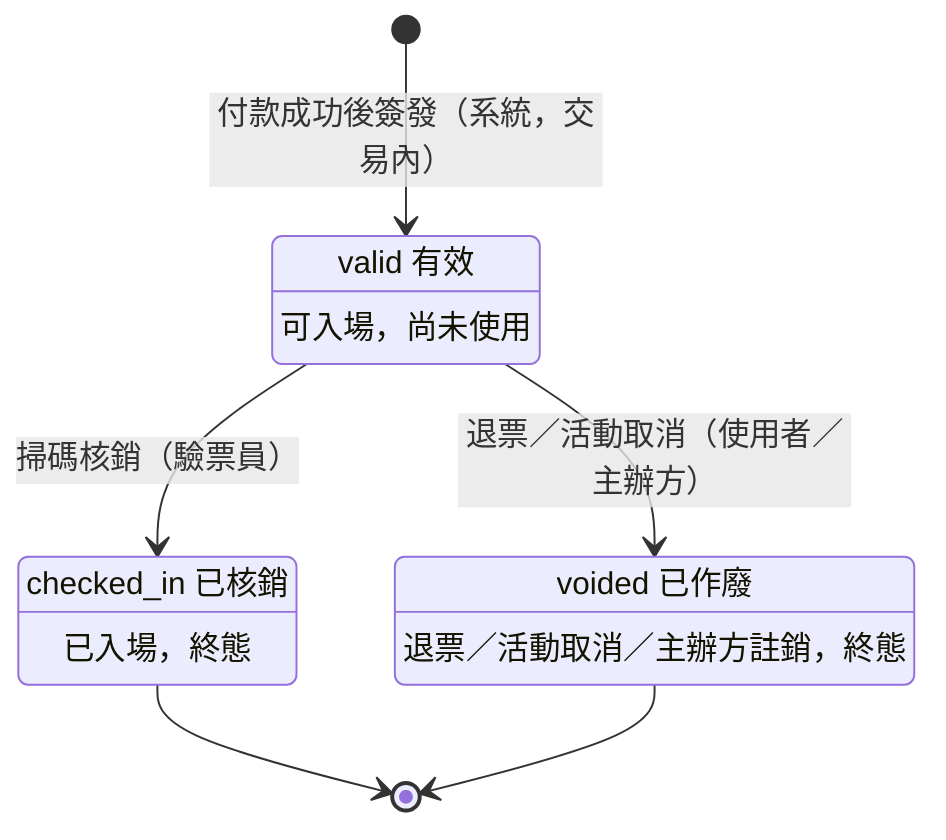
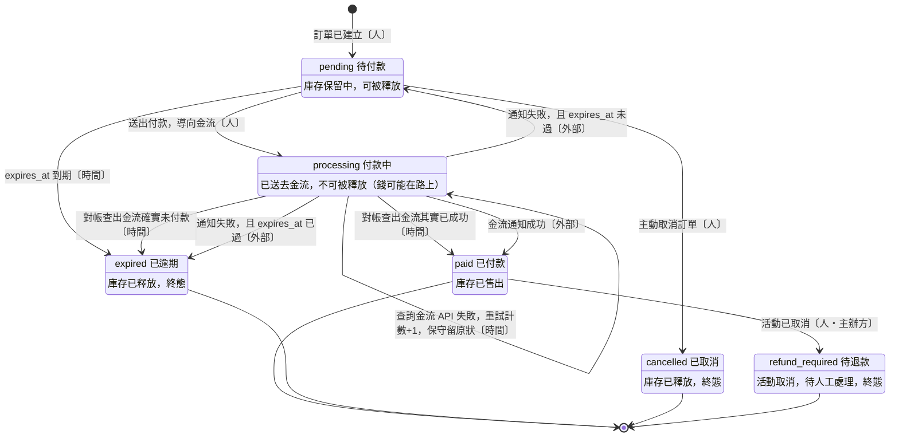

# 狀態機

W2 Step 4。ERD 說「有哪些東西、怎麼連」，狀態機說「**它們什麼時候能變成什麼**」。

## 為什麼要畫

畫狀態機不是為了好看，它有三個**直接**的用途：

1. **產出條件更新的 `WHERE`**
   `WHERE status = 'pending' AND expires_at < NOW()` —— 那個 `'pending'` 從哪來的？
   從狀態機上「哪些狀態可以轉出去」抄的。圖畫對，併發安全就是免費的。
2. **證明「不可能的狀態」真的不可能**
   已付款的訂單不該被逾期任務釋放。這件事不是靠記得，是靠圖上**沒有那條箭頭**。
3. **決定 `status` 欄位有哪些值**
   Step 5 寫 migration 的 enum 直接照抄。

## Mermaid 語法（就這幾行）

```
stateDiagram-v2
    [*] --> 狀態A : 進入的原因
    狀態A --> 狀態B : 觸發的事件（誰觸發）
    狀態B --> [*]
```

- `[*]` 是起點與終點
- `狀態 : 說明文字` 可以在狀態方塊裡加一行註解
- **每條箭頭的標籤都要寫「誰觸發」**（人／外部系統／時間）—— 因為它決定你要寫 controller、webhook handler 還是 queue job

---

## 1. Ticket 票券（示範，含推導過程）



### 推導過程

**① `[*] --> valid` 的觸發者是誰？**
系統，而且在「訂單已付款完成」的**同一個交易內**（Step 2 第三組 Q2 的決定）。
所以票券不存在「待簽發」狀態 —— 沒付款就沒有票券 row。

**② `valid --> checked_in` 怎麼實作？**
這條箭頭直接翻譯成條件更新：

```sql
UPDATE tickets SET checked_in_at = NOW(), checked_in_by = ?
WHERE id = ? AND checked_in_at IS NULL
```

`AND checked_in_at IS NULL` 就是「只能從 valid 轉出」。影響筆數 1 = 入場成功，0 = 已經被用過。
兩個驗票員同時掃同一張票，資料庫保證只有一個拿到 1。

**③ `checked_in --> voided` 要不要？**（核銷後才發現有爭議）
**不要。** 核銷是終態。
爭議的處理方式是在 `SCAN_LOGS` 留紀錄、走線下流程，不是把票券狀態改回去。

**④ `voided --> valid` 要不要？**（誤作廢想救回來）
**不要。** 誤作廢的處理是**重新簽發一張新票**，並保留那張作廢票的紀錄。

### ③④ 背後的原則

> **狀態機盡量單向。不可逆的錯誤用「新增補償紀錄」處理，不要「回滾狀態」。**

為什麼？因為狀態一旦能往回走，所有下游的判斷都不可靠了 —— 你統計「已入場人數」時，數字會**變小**；已經寄出的入場通知無法收回；對帳報表昨天跟今天不一樣。

這跟你在 Step 2 自己發現的那個問題是同一件事：`booked → free` 會抹掉歷史。

---

## 2. Order 訂單（換你畫）

### 狀態清單（來自 Step 2 的討論）

| 狀態 | 含義 | 庫存情況 |
|---|---|---|
| `pending` | 待付款，使用者還沒動作 | 保留中，**可以被釋放** |
| `processing` | 付款中，已送去金流 | 保留中，**不可以被釋放**（錢可能在路上） |
| `paid` | 已付款完成 | 已售出 |
| `expired` | 逾期未付款 | 已釋放 |
| `cancelled` | 使用者主動取消 | 已釋放 |
| `refund_required` | 活動取消，待人工退款 | 已售出（但要退錢） |

### 狀態圖



### 三個設計決定

#### ① 付款失敗回 `pending`，但 `expires_at` **不重新計時**

重新計時的漏洞：使用者故意用無效卡號送出付款 → 失敗 → 回 `pending` 並續約 15 分鐘
→ 重複操作即可**永久佔住熱門票**，而且完全不用付錢。

所以 `expires_at` 在**下單那一刻就固定**，之後任何轉移都不改它。
它代表「這批庫存被佔用的期限」，不是「使用者的操作時間」。

**邊界情況**：付款失敗通知進來時 `expires_at` 已經過了 → 直接轉 `expired`，不要繞去 `pending`。
理由：繞去 `pending` 會出現一個「已過期的待付款訂單」，而在逾期任務跑到它之前，
使用者可能又送出一次付款 → 又進 `processing` → 無限延長。**一步到位比較安全。**

#### ② `processing` 必須有「時間」出口（原本漏掉的黑洞）

任何「等待外部系統」的狀態，都必須有一條時間觸發的出口 ——
否則外部系統不回應時，庫存就永久蒸發。

對帳任務的流程：

```
找出 processing 超過 N 分鐘的訂單
  → 主動呼叫金流商 API 查詢真實狀態
      已付款   → paid
      未付款   → expired（釋放庫存）
      查不到／API 失敗 → 留在 processing，重試計數+1，超過上限就告警
```

**N = 30 分鐘。** 推導：
- `expires_at` 是 15 分鐘，使用者的 3D 驗證（OTP 簡訊）可能再花幾分鐘
- 金流通知正常情況下幾秒內就到，30 分鐘還沒到幾乎確定有問題
- N 必須**遠大於** `expires_at`，才不會誤殺還在正常付款流程中的人

**查詢金流 API 也失敗時，為什麼保守留在 `processing`（自迴圈）？**

因為這時有兩種選擇，代價完全不對等：

| 選擇 | 最壞後果 | 能不能補救 |
|---|---|---|
| 釋放庫存 | 錢收了、票賣給別人了 → **一票二賣** | ❌ 無法挽回 |
| 不釋放 | 庫存被多佔，少賣幾張 | ✅ 人工可釋放 |

> **原則：狀態不確定時，選擇「可人工補救」的那一側。**

不新增「待人工處理」狀態，是因為狀態一多，每個下游查詢都要考慮它。
「重試次數 + 告警」比新增狀態便宜得多。

#### ③ `paid` 不是終態

`paid → refund_required`（活動取消）存在，所以它不是終態。
使用者自行退票的箭頭**不畫** —— 退款範圍外（見 `erd.md`），
將來要做就是補一條 `paid → refund_required`〔人・使用者〕。

### 不存在的箭頭（要寫測試證明它不會發生）

| 不存在的轉移 | 為什麼絕不能有 |
|---|---|
| `paid → expired` | 已付款的訂單被逾期任務誤殺 → 錢收了票沒了 |
| `processing → expired`〔時間〕**未經金流查詢** | 錢可能在路上，必須先確認再釋放 |
| `expired → pending` | 票在逾期那一刻已釋放、可能賣給別人 → 救回來就是搶別人的票 |
| `expired → paid` | 同上，庫存已不屬於這張訂單 |
| `cancelled → 任何狀態` | 使用者已明確取消，終態 |
| 任何狀態 → `pending`（除了 `processing` 且未過期） | `pending` 代表「持有未過期的庫存保留」，不可被憑空製造 |

這張表是 W6 之後的測試清單：每一列寫一個測試，證明那條路走不通。

### 畫完之後，做這個檢查（最重要）

對照著圖，把逾期任務的 SQL 寫出來：

```sql
UPDATE orders SET status = ?
WHERE ??? AND ???
```

然後驗證這三個情境：

| 情境 | 你的 WHERE 會不會誤傷它？ |
|---|---|
| 使用者在 14:50 送出付款，銀行處理中（`processing`） | |
| 使用者已付款成功（`paid`） | |
| 任務重複執行第二次（已經是 `expired`） | |

**三個都必須是「不會」。** 如果有任何一個會，你的狀態機或 WHERE 條件有問題 —— 那就是 Step 2 講的「庫存被重複釋放導致超賣」的漏洞。

---

## 3. Event / EventSession（換你畫）

這張比較簡單，但要拍板一個 `events.md` 裡留下的 `❓`。

### 候選狀態

`draft` 草稿 → `published` 已上架 → `on_sale` 開賣中 → `ended` 已結束
外加 `cancelled` 已取消

### 要決定的

**① `sold_out` 該是一個狀態嗎？**

回想 `events.md` 的 `❓ 活動售完是一種狀態嗎，還是只靠剩餘票數判斷`。

想這個情境：售完 → 有人逾期沒付款 → 庫存釋放 → **又可以賣了**。
- 如果 `sold_out` 是狀態，誰負責把它改回 `on_sale`？漏改會怎樣？
- 如果是推導值（`可賣量 = 0` 就顯示售完），成本是什麼？

**② `published` 和 `on_sale` 要分開嗎？**

回想 `events.md` 的 `❓ 靠排程任務改狀態，還是每次查詢時比較 now() 與 sale_start_at`。
這是同一個問題的另一面：**狀態欄位 vs 時間比較**。

提示：這兩題其實是同一個判斷 —— **「能從別的資料算出來的東西，該不該存成狀態？」**
你在 Step 2 已經學過這個交換（`reserved_count`）：存起來就要對帳。

---

## 4. 填完後產出（Step 5 的直接輸入）

- [ ] 每個 `status` 欄位的合法值清單 → migration 的 enum
- [ ] 每條轉移的 `WHERE` 條件 → 程式裡的條件更新
- [ ] 「不存在的箭頭」清單 → 要寫測試證明它真的不會發生
      例：`paid` 的訂單絕不可能被逾期任務改成 `expired`
