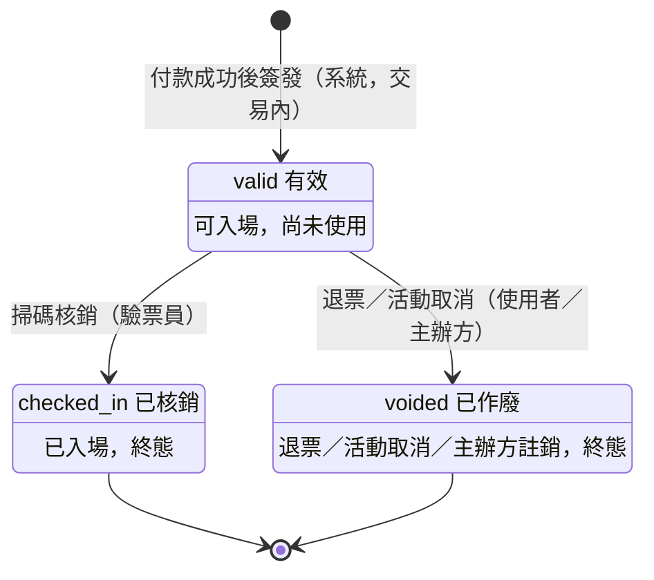
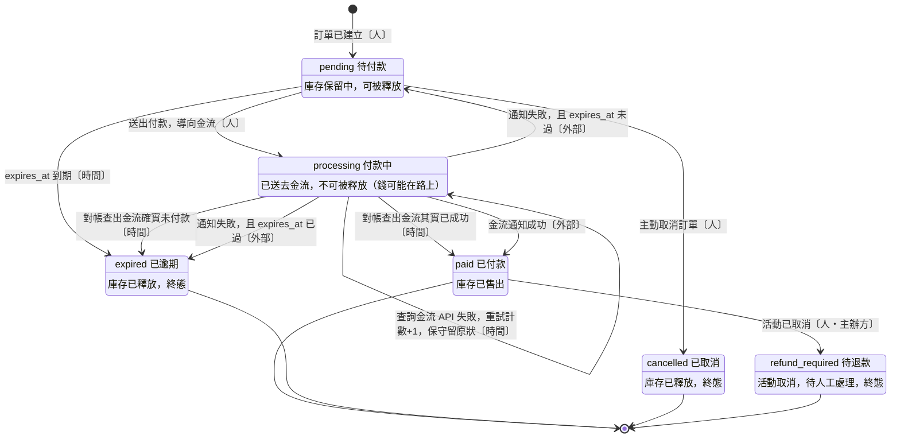
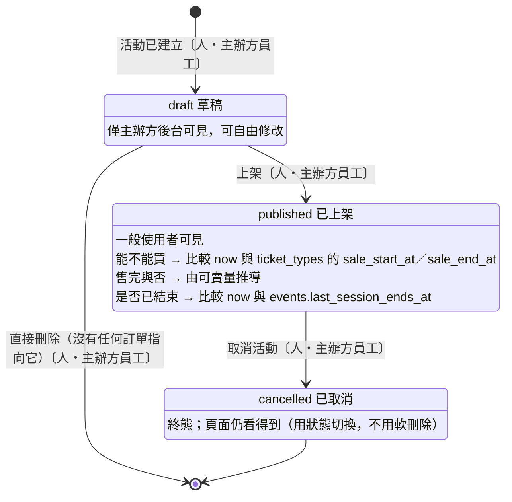
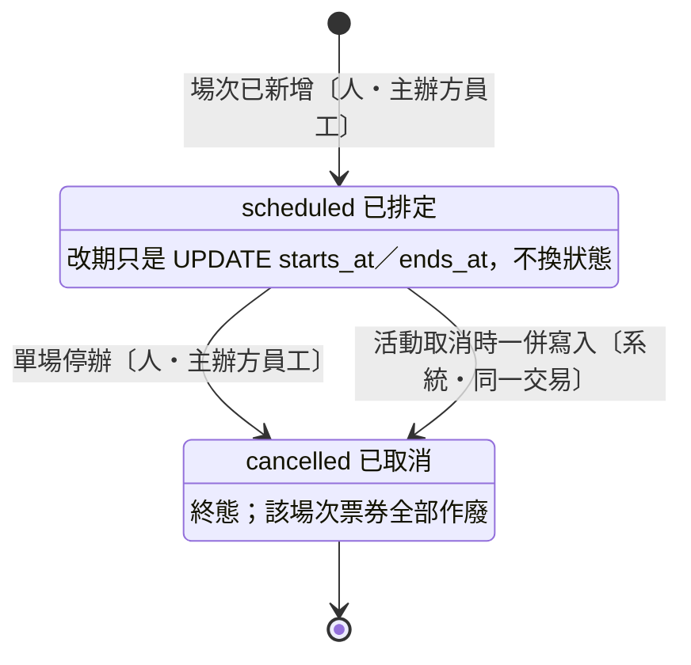

# 狀態機

W2 Step 4。ERD 說「有哪些東西、怎麼連」，狀態機說「**它們什麼時候能變成什麼**」。

## 為什麼要畫

畫狀態機不是為了好看，它有三個**直接**的用途：

1. **產出條件更新的 `WHERE`**
   `WHERE status = 'pending' AND expires_at < NOW()` —— 那個 `'pending'` 從哪來的？
   從狀態機上「哪些狀態可以轉出去」抄的。圖畫對，併發安全就是免費的。
2. **證明「不可能的狀態」真的不可能**
   已付款的訂單不該被逾期任務釋放。這件事不是靠記得，是靠圖上**沒有那條箭頭**。
3. **決定 `status` 欄位有哪些值**
   Step 5 寫 migration 的 enum 直接照抄。

## Mermaid 語法（就這幾行）

```
stateDiagram-v2
    [*] --> 狀態A : 進入的原因
    狀態A --> 狀態B : 觸發的事件（誰觸發）
    狀態B --> [*]
```

- `[*]` 是起點與終點
- `狀態 : 說明文字` 可以在狀態方塊裡加一行註解
- **每條箭頭的標籤都要寫「誰觸發」**（人／外部系統／時間）—— 因為它決定你要寫 controller、webhook handler 還是 queue job

---

## 1. Ticket 票券（示範，含推導過程）



### 推導過程

**① `[*] --> valid` 的觸發者是誰？**
系統，而且在「訂單已付款完成」的**同一個交易內**（Step 2 第三組 Q2 的決定）。
所以票券不存在「待簽發」狀態 —— 沒付款就沒有票券 row。

**② `valid --> checked_in` 怎麼實作？**
這條箭頭直接翻譯成條件更新：

```sql
UPDATE tickets SET checked_in_at = NOW(), checked_in_by = ?
WHERE id = ? AND checked_in_at IS NULL
```

`AND checked_in_at IS NULL` 就是「只能從 valid 轉出」。影響筆數 1 = 入場成功，0 = 已經被用過。
兩個驗票員同時掃同一張票，資料庫保證只有一個拿到 1。

**③ `checked_in --> voided` 要不要？**（核銷後才發現有爭議）
**不要。** 核銷是終態。
爭議的處理方式是在 `SCAN_LOGS` 留紀錄、走線下流程，不是把票券狀態改回去。

**④ `voided --> valid` 要不要？**（誤作廢想救回來）
**不要。** 誤作廢的處理是**重新簽發一張新票**，並保留那張作廢票的紀錄。

### ③④ 背後的原則

> **狀態機盡量單向。不可逆的錯誤用「新增補償紀錄」處理，不要「回滾狀態」。**

為什麼？因為狀態一旦能往回走，所有下游的判斷都不可靠了 —— 你統計「已入場人數」時，數字會**變小**；已經寄出的入場通知無法收回；對帳報表昨天跟今天不一樣。

這跟你在 Step 2 自己發現的那個問題是同一件事：`booked → free` 會抹掉歷史。

---

## 2. Order 訂單（換你畫）

### 狀態清單（來自 Step 2 的討論）

| 狀態 | 含義 | 庫存情況 |
|---|---|---|
| `pending` | 待付款，使用者還沒動作 | 保留中，**可以被釋放** |
| `processing` | 付款中，已送去金流 | 保留中，**不可以被釋放**（錢可能在路上） |
| `paid` | 已付款完成 | 已售出 |
| `expired` | 逾期未付款 | 已釋放 |
| `cancelled` | 使用者主動取消 | 已釋放 |
| `refund_required` | 活動取消，待人工退款 | 已售出（但要退錢） |

### 狀態圖



### 三個設計決定

#### ① 付款失敗回 `pending`，但 `expires_at` **不重新計時**

重新計時的漏洞：使用者故意用無效卡號送出付款 → 失敗 → 回 `pending` 並續約 15 分鐘
→ 重複操作即可**永久佔住熱門票**，而且完全不用付錢。

所以 `expires_at` 在**下單那一刻就固定**，之後任何轉移都不改它。
它代表「這批庫存被佔用的期限」，不是「使用者的操作時間」。

**邊界情況**：付款失敗通知進來時 `expires_at` 已經過了 → 直接轉 `expired`，不要繞去 `pending`。
理由：繞去 `pending` 會出現一個「已過期的待付款訂單」，而在逾期任務跑到它之前，
使用者可能又送出一次付款 → 又進 `processing` → 無限延長。**一步到位比較安全。**

#### ② `processing` 必須有「時間」出口（原本漏掉的黑洞）

任何「等待外部系統」的狀態，都必須有一條時間觸發的出口 ——
否則外部系統不回應時，庫存就永久蒸發。

對帳任務的流程：

```
找出 processing 超過 N 分鐘的訂單
  → 主動呼叫金流商 API 查詢真實狀態
      已付款   → paid
      未付款   → expired（釋放庫存）
      查不到／API 失敗 → 留在 processing，重試計數+1，超過上限就告警
```

**N = 30 分鐘。** 推導：
- `expires_at` 是 15 分鐘，使用者的 3D 驗證（OTP 簡訊）可能再花幾分鐘
- 金流通知正常情況下幾秒內就到，30 分鐘還沒到幾乎確定有問題
- N 必須**遠大於** `expires_at`，才不會誤殺還在正常付款流程中的人

**查詢金流 API 也失敗時，為什麼保守留在 `processing`（自迴圈）？**

因為這時有兩種選擇，代價完全不對等：

| 選擇 | 最壞後果 | 能不能補救 |
|---|---|---|
| 釋放庫存 | 錢收了、票賣給別人了 → **一票二賣** | ❌ 無法挽回 |
| 不釋放 | 庫存被多佔，少賣幾張 | ✅ 人工可釋放 |

> **原則：狀態不確定時，選擇「可人工補救」的那一側。**

不新增「待人工處理」狀態，是因為狀態一多，每個下游查詢都要考慮它。
「重試次數 + 告警」比新增狀態便宜得多。

#### ③ `paid` 不是終態

`paid → refund_required`（活動取消）存在，所以它不是終態。
使用者自行退票的箭頭**不畫** —— 退款範圍外（見 `erd.md`），
將來要做就是補一條 `paid → refund_required`〔人・使用者〕。

### 不存在的箭頭（要寫測試證明它不會發生）

| 不存在的轉移 | 為什麼絕不能有 |
|---|---|
| `paid → expired` | 已付款的訂單被逾期任務誤殺 → 錢收了票沒了 |
| `processing → expired`〔時間〕**未經金流查詢** | 錢可能在路上，必須先確認再釋放 |
| `expired → pending` | 票在逾期那一刻已釋放、可能賣給別人 → 救回來就是搶別人的票 |
| `expired → paid` | 同上，庫存已不屬於這張訂單 |
| `cancelled → 任何狀態` | 使用者已明確取消，終態 |
| 任何狀態 → `pending`（除了 `processing` 且未過期） | `pending` 代表「持有未過期的庫存保留」，不可被憑空製造 |

這張表是 W6 之後的測試清單：每一列寫一個測試，證明那條路走不通。

### 畫完之後，做這個檢查（最重要）

對照著圖，把逾期任務的 SQL 寫出來：

```sql
UPDATE orders SET status = ?
WHERE ??? AND ???
```

然後驗證這三個情境：

| 情境 | 你的 WHERE 會不會誤傷它？ |
|---|---|
| 使用者在 14:50 送出付款，銀行處理中（`processing`） | |
| 使用者已付款成功（`paid`） | |
| 任務重複執行第二次（已經是 `expired`） | |

**三個都必須是「不會」。** 如果有任何一個會，你的狀態機或 WHERE 條件有問題 —— 那就是 Step 2 講的「庫存被重複釋放導致超賣」的漏洞。

---

## 3. Event / EventSession

這張比較簡單，但四個候選狀態裡有三個活不下來。

### 候選狀態（原始清單）

`draft` 草稿 → `published` 已上架 → `on_sale` 開賣中 → `ended` 已結束
外加 `cancelled` 已取消

拍板結果：**只留 `draft` / `published` / `cancelled`**，`on_sale`、`sold_out`、`ended` 三個全部降為推導值。
推導過程如下。

---

### ① `sold_out` 不是狀態，是推導值

對應 `events.md` 的 `❓ 這是一個獨立「狀態」，還是從剩餘量推導出來的顯示結果？`

把情境走一遍：**售完 → 有人逾期沒付款 → 庫存釋放 → 又可以賣了**。

如果 `sold_out` 是狀態，誰負責把它改回去？答案是**逾期任務** —— 也就是說，逾期任務除了改訂單狀態、釋放票種庫存，還要回頭改活動狀態。多一個必須記得做的動作，就多一個會漏掉的地方，而漏掉的後果是：**票還在，頁面卻顯示售完，直接少賣**。

還有一個更根本的問題：售完是**票種層級**的事實。早鳥票賣完不代表全票賣完，掛在活動上本來就對不齊粒度。

誠實記下成本：改成推導後，每次列表查詢都要算可賣量。但這個數字本來就要顯示給使用者看（「剩 12 張」），所以不是額外成本。真正的代價會在 W11–W13 出現 —— 高併發下這個計數是熱點，那時的解法是 Redis 計數器，**不是把 `status` 欄位加回來**。

> **原則：推導值翻轉得越頻繁，越不該存成狀態。**
> `sold_out` 隨每一筆成交與每一次逾期釋放來回翻轉 —— 正是最不該存的那一類。

---

### ② `published` 與 `on_sale` 不分開，開賣靠時間比較

對應 `events.md` 的 `❓ 靠排程任務改狀態，還是每次查詢時比較 now() 與 sale_start_at？`

拆成狀態的代價很具體：排程掛掉 → 開賣時間到了但狀態沒改 → **整場賣不了票**。
開賣那一瞬間是這個系統最不能出錯的時刻，把它綁在排程的可用性上，等於拿主線功能去賭基礎設施 —— 而 `events.md` 自己就問了下一句：「排程掛掉就不能賣票，能接受嗎？」不能。

第二個理由跟 ① 同型：販售起訖時間掛在 **`TICKET_TYPES`**（見 `events.md`「票種已新增」），同一場次的早鳥票與全票開賣時間本來就不同。「開賣中」根本不是活動層級的單一事實。

所以 `published` 只表達一件事：**已公開，一般使用者看得到**。
能不能買，是請求當下比較 `now()` 與 `ticket_types.sale_start_at / sale_end_at` 的結果。

排程仍然有用，但只用來**通知**（開賣前推播提醒），不用來**授權**。排程掛掉只是少一封信，不會賣不了票。

> **原則：排程可以用來「推一把」，不可以用來「開門」。**
> 開門的條件必須能在請求當下自己算出來。

---

### ③ `ended` 也不是狀態（同一把尺量下去的結果）

這題原本不在待決清單上，但用 ①② 的標準一量就過不了：
`ended` 能從 `max(event_sessions.ends_at) < now()` 推導出來，要存成狀態就得有排程去翻它 —— 跟 ② 同一個結構。

而且它**不是單向的**。`events.md` 有「活動已改期」這個事件：場次延期 → 一個已經 `ended` 的活動又變回未結束。這跟 `sold_out` 的來回翻轉是同一個問題。

保留 `ended` 唯一像樣的理由是查詢效率：列出「尚未結束的活動」要 join `event_sessions` 再取 `max(ends_at)`，每次列表都做一次。

**解法不是加狀態，是在 `events` 上放一個去正規化欄位 `last_session_ends_at`**，列表查詢變成：

```sql
WHERE status = 'published' AND last_session_ends_at > NOW()
```

為什麼這個去正規化可以接受，而 `reserved_count` 要小心？差別在**變動頻率與來源**：

| 去正規化欄位 | 誰會改它 | 頻率 | 對帳成本 |
|---|---|---|---|
| `reserved_count` | 每一筆下單、每一次逾期釋放 | 搶票時每秒數百次 | 高，要防併發、要對帳 |
| `last_session_ends_at` | 主辦方新增／修改／刪除場次 | 一場活動一輩子幾次 | 低，在同一交易內重算即可 |

> **原則：去正規化的成本不看「有沒有重複」，看「重複的那份資料多常變、被誰改」。**
> 跟著交易高頻變動的，存起來就要付對帳成本；跟著管理操作低頻變動的，存起來幾乎免費。

（`last_session_ends_at` 是 Step 5 的欄位決定，寫在這裡是因為它是「不做 `ended` 狀態」的配套。）

---

### ④ 順帶拍板：不做「下架」

對應 `events.md` 的 `❓ 下架 ≠ 取消，需要兩種概念嗎？`

`published → draft` **不畫**。已公開的活動退回草稿，會讓使用者眼中的活動憑空消失，而已售出的票券還指著它 —— 這是 Ticket 那節「不要回滾狀態」的同一個毛病。

主辦方真正想要的是「別再賣了」，那是把 `ticket_types.sale_end_at` 改到現在。**又是時間欄位，不是狀態** —— 與 ② 同一個答案。

---

### 狀態圖：Event



`cancelled` 用狀態而不用軟刪除，直接回答了 `events.md` 的
`❓ 取消後頁面還看得到嗎？用狀態切換還是軟刪除？` ——
提示裡已經寫了答案：軟刪除會讓已付款訂單的外鍵指向消失的活動。

### 狀態圖：EventSession

場次需要自己的狀態，只要兩個值。



**為什麼場次要有自己的狀態？**
颱風停辦 12/25 那一場，12/26 照常 —— 沒有場次狀態的話，這件事只能靠取消整個活動來表達，會**誤殺其他場次的購票者**。

**為什麼「改期」不是狀態？**
改期之後場次還是 `scheduled`，只是時間不同。它是一次 UPDATE 加一輪通知，不是狀態轉移。舊時間要留存的話那是歷史紀錄的問題（`events.md`「活動已改期」列的事實），不是狀態欄位的問題。

**活動取消時，場次狀態寫不寫？**
寫，而且在同一個交易內把該活動所有 `scheduled` 場次一起改成 `cancelled`。

看起來是冗餘（從場次 join 回活動也知道活動取消了），但驗票是讀取熱路徑、只認場次，不該每掃一張票都多 join 一層活動去問「你的活動是不是取消了」。活動取消則是一輩子幾次的極低頻寫入。

> **原則：低頻寫入多做一次，換熱路徑每次都少做一次。**
> 這跟 ③ 的 `last_session_ends_at` 是同一個交換。

### 路徑走查找到的缺口：一筆訂單可以跨場次嗎？

寫「場次取消 → 該場次的已付款訂單轉 `refund_required`」時卡住了：
`ORDER_ITEMS → TICKET_TYPES → EVENT_SESSIONS`，一筆訂單的不同明細**可能指向不同場次**。
那麼只取消其中一場時，那筆訂單要整張轉 `refund_required` 嗎？其他場次的票還有效啊。

這會把 Order 狀態機逼出「部分退款」，而部分退款在 `erd.md` 已經明確排除。

**決定：限制一筆訂單只能購買同一場次的票種。** 在 W9 下單流程以應用層驗證擋下。

代價：使用者想買兩場就得下兩筆訂單、付兩次款。
換到的東西：取消、退款、驗票三條路徑都不必處理「一張訂單橫跨多場次」的分支。對一個要把重心放在防超賣的專案，這個交換划算。

留的出口：`ORDER_ITEMS` 走兩層 join 就能拿到場次，將來要放寬限制不用改表結構。

> 與 `erd.md` 的「持票人」缺口一樣 —— **走查暴露的不一定是漏線，也可能是漏掉一條約束。**

### 轉移的 `WHERE` 條件

上架（`draft → published`）：

```sql
UPDATE events SET status = 'published', published_at = NOW(), published_by = ?
WHERE id = ? AND status = 'draft'
```

`AND status = 'draft'` 讓重複點兩次「上架」的第二次影響 0 筆，`published_at` 不會被蓋掉。
另外兩個條件（至少一個場次、至少一個票種）資料庫表達不了，在應用層驗證 ——
這正是 `erd.md` 裡 `EVENT_SESSIONS ||--o{ TICKET_TYPES` 用 `o{` 的原因。

取消活動（`published → cancelled`）：

```sql
UPDATE events SET status = 'cancelled', cancelled_at = NOW(), cancelled_by = ?
WHERE id = ? AND status = 'published' AND last_session_ends_at > NOW()
```

`last_session_ends_at > NOW()` 就是「已結束的活動不能取消」。
因為 `ended` 不是狀態，這個限制只能寫成時間比較 —— **這就是 ③ 那個決定的帳單，先付清比較好**。

取消場次（`scheduled → cancelled`）：

```sql
UPDATE event_sessions SET status = 'cancelled', cancelled_at = NOW()
WHERE id = ? AND status = 'scheduled' AND ends_at > NOW()
```

### 不存在的箭頭（要寫測試證明它不會發生）

| 不存在的轉移 | 為什麼絕不能有 |
|---|---|
| `published → draft` | 已公開的活動憑空消失，已售票券指向它；要的是停售，不是退回草稿 |
| `cancelled → published` | 取消時已觸發退款流程與通知，救回來等於讓已退款的票復活 |
| `draft → cancelled` | draft 沒有任何訂單指向它，直接刪除即可；`cancelled` 的語意保留給「可能已售票」的活動 |
| 已結束的活動 → `cancelled` | 活動都辦完了還取消，語意矛盾；靠 `last_session_ends_at > NOW()` 擋 |
| `EventSession: cancelled → scheduled` | 停辦通知已寄出、票券已作廢，改回來救不回那些票 |

---

## 4. 填完後產出（Step 5 的直接輸入）

- [x] 每個 `status` 欄位的合法值清單 → migration 的 enum
- [x] 每條轉移的 `WHERE` 條件 → 程式裡的條件更新
- [x] 「不存在的箭頭」清單 → 要寫測試證明它真的不會發生

### 4.1 `status` 欄位清單

| 表 | 欄位 | 合法值 | 預設 |
|---|---|---|---|
| `events` | `status` | `draft` / `published` / `cancelled` | `draft` |
| `event_sessions` | `status` | `scheduled` / `cancelled` | `scheduled` |
| `orders` | `status` | `pending` / `processing` / `paid` / `expired` / `cancelled` / `refund_required` | `pending` |
| `tickets` | — | **不需要 `status` 欄位**，見 4.2 | — |

推導值一覽（**不進資料庫**）：

| 推導值 | 怎麼算 | 決定於 |
|---|---|---|
| 活動開賣中 | `now()` 介於 `ticket_types.sale_start_at` 與 `sale_end_at` | ② |
| 票種售完 | 可賣量 = 0 | ① |
| 活動已結束 | `now() > events.last_session_ends_at` | ③ |
| 票券狀態 | 由 `voided_at` / `checked_in_at` 推導 | 4.2 |

### 4.2 `tickets` 為什麼不用 `status` 欄位

Ticket 的三個狀態 `valid` / `checked_in` / `voided`，可以完全由兩個時間欄位推導：

```
voided_at IS NOT NULL      → voided
checked_in_at IS NOT NULL  → checked_in
兩者皆 NULL                → valid
```

`checked_in_at` 本來就必須存在（`erd.md` 已決定不建 `CHECK_INS` 表，核銷時間記在票券上），
`voided_at` 也必須存在（作廢時間是 `events.md`「票券已作廢」要求記下的事實）。
再多一個 `status` 欄位，只是製造「`status` 說有效、`checked_in_at` 卻有值」這種不一致的可能。

而且核銷的條件更新本來就是打在時間欄位上，不是打在 `status` 上：

```sql
UPDATE tickets SET checked_in_at = NOW(), checked_in_by = ?, checked_in_gate = ?
WHERE id = ? AND checked_in_at IS NULL AND voided_at IS NULL
```

`AND voided_at IS NULL` 就是「`voided` 不能轉去 `checked_in`」—— 圖上沒有那條箭頭，`WHERE` 就多這一行。

> **原則：狀態欄位要跟條件更新的 `WHERE` 打在同一組欄位上。**
> 分開就會有兩份真相，遲早對不起來。

### 4.3 轉移條件總表

| 轉移 | 觸發 | `WHERE` 的關鍵條件 |
|---|---|---|
| `events`: `draft → published` | 人 | `status = 'draft'` |
| `events`: `published → cancelled` | 人 | `status = 'published' AND last_session_ends_at > NOW()` |
| `event_sessions`: `scheduled → cancelled` | 人／系統 | `status = 'scheduled' AND ends_at > NOW()` |
| `orders`: `pending → expired` | 時間 | `status = 'pending' AND expires_at <= NOW()` |
| `orders`: `pending → processing` | 人 | `status = 'pending' AND expires_at > NOW()` |
| `orders`: `processing → paid` | 外部／時間 | `status = 'processing'` |
| `orders`: `processing → expired` | 時間 | `status = 'processing'` **且已向金流查證未付款** |
| `tickets`: `valid → checked_in` | 驗票員 | `checked_in_at IS NULL AND voided_at IS NULL` |
| `tickets`: `valid → voided` | 系統／主辦方 | `voided_at IS NULL AND checked_in_at IS NULL` |

逾期任務的 `WHERE` 對三個情境的驗證（第 2 節的檢查題）：

| 情境 | `status = 'pending' AND expires_at <= NOW()` 會誤傷嗎 |
|---|---|
| 14:50 送出付款，銀行處理中（`processing`） | 不會 —— `status` 已不是 `pending` |
| 已付款成功（`paid`） | 不會 —— 同上，這就是「圖上沒有 `paid → expired`」的具體保障 |
| 任務重複執行第二次（已 `expired`） | 不會 —— 影響 0 筆，天然冪等 |

### 4.4 要寫的測試清單

第 2 節與第 3 節的「不存在的箭頭」兩張表，每一列一個測試。W6 之後補上。

---

## 5. 下一步

Step 5：欄位與索引。這份文件的直接輸出：

- 四個 `status` 欄位的 enum 值（4.1）
- `events.last_session_ends_at` 去正規化欄位（③）
- `tickets` 不要 `status`，改用 `voided_at` / `checked_in_at`（4.2）
- `orders.expires_at` 下單即固定、任何轉移都不更新（第 2 節 ①）
- 應用層約束：一筆訂單只能買同一場次的票種（第 3 節走查）
